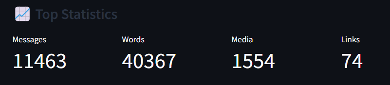

# WhatsApp Chat Analyzer


This is a **WhatsApp Chat Analyzer** built with **Streamlit**, which allows users to upload their WhatsApp chat data and perform various analyses on it. It generates insightful visualizations like word clouds, message timelines, activity maps, and more. The app also allows users to explore statistics such as the most active users, most used words, and emojis.

## Features
- **Top Statistics**: Displays the total number of messages, words, media files, and links.
- **Monthly Timeline**: Visualizes messages over time (by month).
- **Daily Timeline**: Visualizes messages by day.
- **Activity Map**: Provides weekly and monthly activity analysis.
- **Heatmap**: Shows message activity by day and period.
- **Busiest Users**: Identifies the most active users in the chat.
- **Word Cloud**: Displays the most frequent words used.
- **Most Used Words**: Shows the top 20 most frequent words used.
- **Most Used Emojis**: Displays the top 20 most used emojis.

## Users Guide


## Requirements

- **Python 3.6+**
- **Required Libraries**:
  - `emoji==1.7.0`
  - `pandas`
  - `streamlit`
  - `matplotlib`
  - `urlextract`
  - `wordcloud`
  - `seaborn`

## Setup and Installation

### 1. Clone this repository:

```bash
git clone https://github.com/your-username/whatsapp-chat-analyzer.git
cd whatsapp-chat-analyzer
```

### 2. Create and activate a virtual environment (optional but recommended):

```bash
python -m venv venv
source venv/bin/activate  # On Windows use `venv\Scripts\activate`
```

### 3. Install the required libraries:

```bash
pip install -r requirements.txt
```

### 4. Run the Streamlit app:

```bash
streamlit run app.py
```

This will launch the Streamlit app in your default browser.

## Usage

1. **Upload a WhatsApp chat file**:
   - Click on the **Upload** button in the sidebar.
   - Select your exported WhatsApp chat file (in `.txt` format).
   
2. **Select a user**:
   - From the dropdown, choose the user or select "Overall" for the entire chat data.

3. **View the Analysis**:
   - Click the **Show Analysis** button to view the results.

## Code Snippets

### 1. **Preprocessing the Data**

The preprocessing function cleans and formats the WhatsApp chat data into a DataFrame for analysis.

```python
import re
import pandas as pd

def preprocess(data):
    pattern = '\d+/\d+/\d+, \d+:\d+\s*[ap]m -'
    messages = re.split(pattern, data)[1:]
    dates = re.findall(pattern, data)
    df = pd.DataFrame({'user_message':messages,'message_date':dates})
    df['message_date'] = pd.to_datetime(df.message_date.str.replace('\u202f', ' '), format='%d/%m/%y, %I:%M %p -', errors='coerce')
    df['user_message'] = df['user_message'].str.replace('\n', '')
    df.rename(columns={'message_date' : 'date'}, inplace=True)

    users = []
    messages = []
    for message in df['user_message']:
        entry = re.split('([\w\W]+?):\s', message)
        if entry[1:]:
            users.append(entry[1])
            messages.append(entry[2])
        else:
            users.append('group_notification')
            messages.append(entry[0])

    df['users'] = users
    df['messages'] = messages
    df.drop(columns=['user_message'], inplace=True)
    df['only_date'] = df['date'].dt.date
    df['year'] = df['date'].dt.year
    df['month_num'] = df['date'].dt.month
    df['month'] = df['date'].dt.month_name()
    df['day'] = df['date'].dt.day
    df['day_name'] = df['date'].dt.day_name()
    df['hour'] = df['date'].dt.hour
    df['minute'] = df['date'].dt.minute

    period = []
    for hour in df[['day_name', 'hour']]['hour']:
        if hour == 23:
            period.append(str(hour) + "-" + str('00'))
        elif hour == 0:
            period.append(str('00') + "-" + str(hour + 1))
        else:
            period.append(str(hour) + "-" + str(hour + 1))
    df['period'] = period

    return df
```

### 2. **Fetching Statistics**

This function extracts basic statistics like the number of messages, words, media, and links.

```python
from urlextract import URLExtract

def fetch_stats(user_name, df):
    if user_name != 'Overall':
        df = df[df['users'] == user_name]
    num_messages = df.shape[0]
    words = [word for message in df['messages'] for word in message.split()]
    num_media = df[df['messages'] == '<Media omitted>'].shape[0]
    extract = URLExtract()
    links = [link for message in df['messages'] for link in extract.find_urls(message)]

    return num_messages, len(words), num_media, len(links)
```

### 3. **Generating Word Cloud**

This function generates a word cloud of the most frequent words in the messages.

```python
from wordcloud import WordCloud

def create_wordcloud(selected_user, df):
    if selected_user != 'Overall':
        df = df[df['users'] == selected_user]

    temp = df[df['users'] != 'group_notification']
    temp = temp[temp['messages'] != '<Media omitted>']
    f = open('stop_hinglish.txt', 'r')
    stop_words = f.read()
    words = [word for message in temp['messages'] for word in message.lower().split()]

    wc = WordCloud(width=500, height=500, min_font_size=10, background_color='white')
    df_wc = wc.generate(temp['messages'].str.cat(sep=" "))
    return df_wc
```

## Screenshots

### 1. **Top Statistics**:


### 2. **Monthly Timeline**:


### 3. **Busiest Users**:


### 4. **Word Cloud**:


### 5. **Activity Heatmap**:


## Contribution

Feel free to fork this repository and contribute by submitting pull requests. If you encounter any issues, open an issue in the repository.

## License

This project is licensed under the MIT License - see the [LICENSE](LICENSE) file for details.
